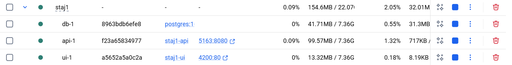
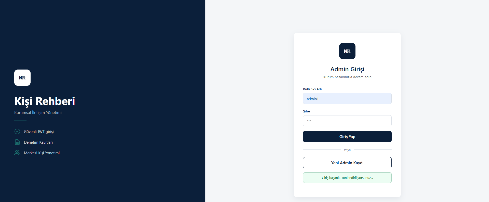
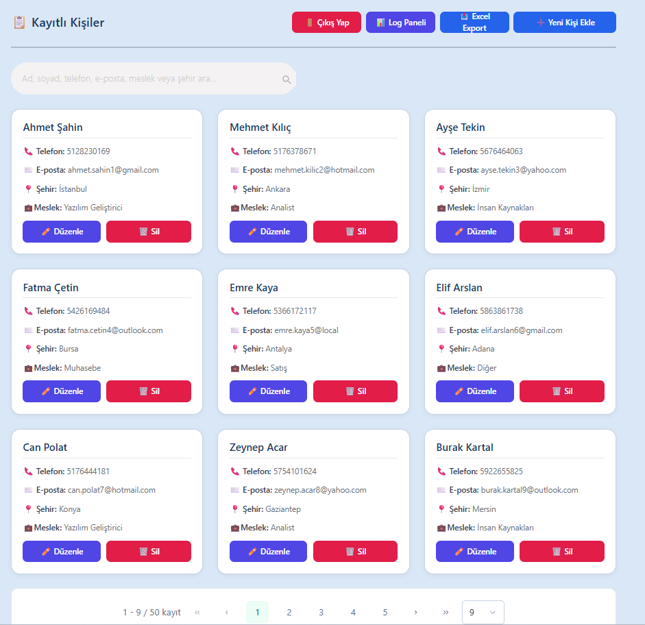
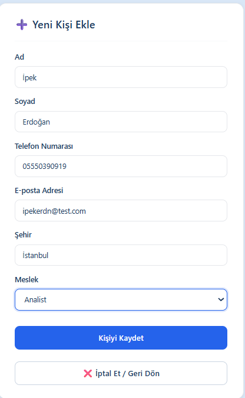
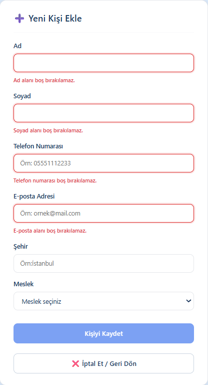
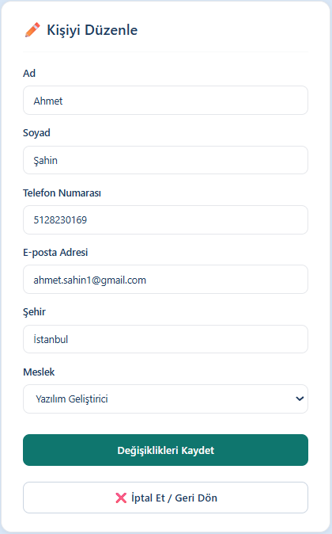
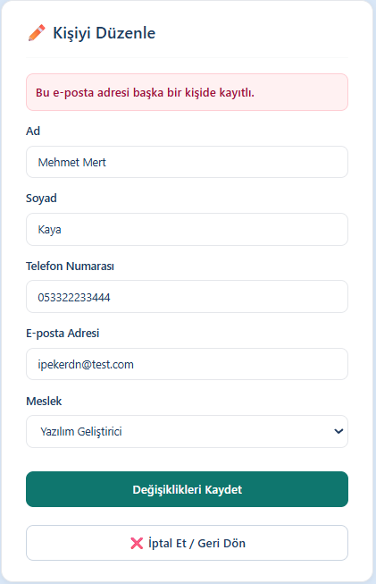
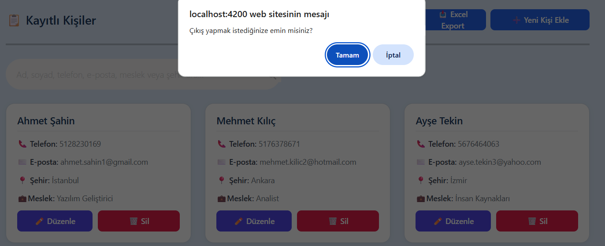
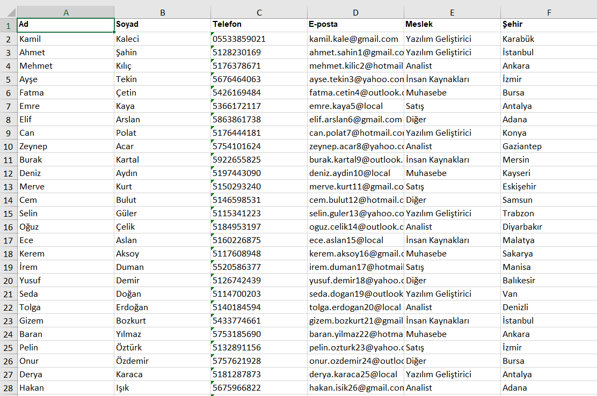
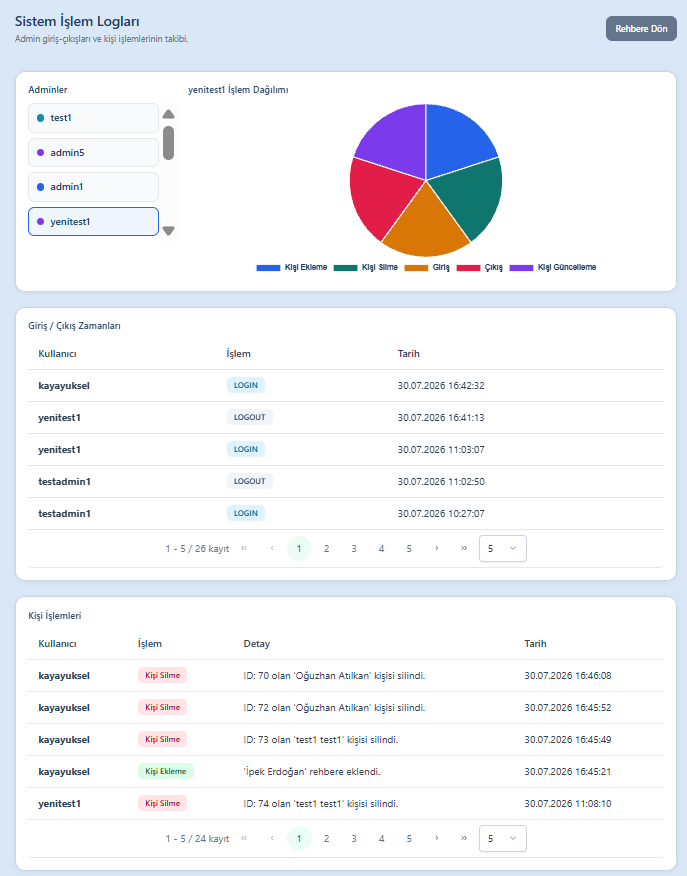

# Kişi Rehberi Uygulaması

Şirket içi kişileri ekleyip listeleyebileceğiniz, güncelleyip silebileceğiniz bir rehber uygulamasıdır. JWT ile admin girişi, meslek seçimi, şehir bilgisi, Excel dışa aktarma ve işlem logları (audit) paneli bulunur. Geliştirme ortamında yerelde veya Docker Compose ile ayağa kaldırılabilir.

**Stack:** Angular · ASP.NET Core Minimal API · Entity Framework Core · PostgreSQL · Docker

---

## Klasör yapısı

```
staj1/
├── docker-compose.yml      # Postgres + API + UI
├── docs/screenshots/       # README ekran görüntüleri
├── kisi-rehberi-ui/        # Frontend (Angular)
│   ├── Dockerfile
│   └── nginx.conf
└── KisiRehberiApi/         # Backend (Minimal API + EF Core)
    └── Dockerfile
```

---

## Gereksinimler

### Yerel geliştirme
- [.NET SDK](https://dotnet.microsoft.com/download) (9 önerilir)
- [Node.js](https://nodejs.org/) ve npm
- [PostgreSQL](https://www.postgresql.org/)
- (İsteğe bağlı) Visual Studio / VS Code / Cursor

### Docker ile çalıştırma
- [Docker Desktop](https://www.docker.com/products/docker-desktop/)

---

## Hızlı başlangıç — Docker (önerilen demo yolu)

Proje kökünde:

```bash
docker compose up --build
```

| Servis | Adres |
|--------|--------|
| UI | http://localhost:4200 |
| API | http://localhost:5163 |
| Postgres | container içi `db:5432` (dışarıya port açılmamış) |

Compose ortamında bağlantı dizesi ve JWT anahtarı `docker-compose.yml` içindeki environment değişkenleriyle verilir. API ayağa kalkınca migration’ları uygular; meslek tablosu boşsa örnek meslekleri seed eder.

> Docker Postgres **ayrı bir veritabanıdır**. Daha önce bilgisayarındaki local Postgres’te tuttuğun kişiler otomatik gelmez; demo için kişi eklemen veya seed kullanman gerekir.



---

## Kurulum — Backend (yerel)

1. `KisiRehberiApi` klasörüne girin.
2. Bağlantı dizesi ve JWT anahtarını **User Secrets** (veya ortam değişkeni) ile verin.  
   `appsettings.json` içinde hassas bilgiler tutulmaz.
3. Migration’ları uygulayın:

   ```bash
   dotnet ef database update
   ```

4. API’yi başlatın:

   ```bash
   dotnet run
   ```

5. API adresi varsayılan olarak: `http://localhost:5163`

> Not: İlk çalıştırmada meslek listesi boşsa uygulama seed ile örnek meslekleri ekler. Docker’da `MigrateAsync` startup’ta da çalışır.

---

## Kurulum — Frontend (yerel)

1. `kisi-rehberi-ui` klasörüne girin.
2. Bağımlılıkları yükleyin:

   ```bash
   npm install --legacy-peer-deps
   ```

3. API adresi kodda `http://localhost:5163` olarak geçiyor. Backend farklı portta çalışıyorsa ilgili servis dosyalarındaki URL’leri güncelleyin.
4. Uygulamayı başlatın:

   ```bash
   ng serve
   ```

5. Tarayıcıda açın: http://localhost:4200

---

## İlk kullanım

### 1) Kayıt ol / Giriş yap



Uygulama açılınca login ekranı gelir. Hesabınız yoksa **Kayıt Ol** ile admin oluşturabilir, ardından kullanıcı adı ve şifre ile **Giriş Yap** dersiniz. Başarılı girişte JWT token kaydedilir ve rehber listesine yönlendirilirsiniz.

### 2) Kişi listesi



Rehberde kayıtlı kişiler kartlar halinde listelenir (ad, soyad, telefon, e-posta, meslek, **şehir**). Üstten arama yapabilir (şehir dahil); **Yeni Kişi Ekle**, **Excel’e Aktar**, **Log Paneli** veya **Çıkış Yap** butonlarını kullanabilirsiniz.

### 3) Yeni kişi ekleme



**Yeni Kişi Ekle** ile forma gidin. Ad, soyad, telefon ve e-posta zorunludur; **şehir** ve meslek isteğe bağlıdır. Telefon yalnızca rakam kabul eder (10–11 hane). Kayıt başarılı olunca listeye dönersiniz.



Formdaki zorunlu alanlar boş bırakılamaz; telefon formatı geçersizse uyarı gösterilir. Form geçersizken kaydet butonu kilitli kalır.

### 4) Kişi düzenleme



Listede **Düzenle** ile mevcut kaydın formu açılır. Şehir dahil bilgileri güncelleyip kaydedin.



Bir kişinin e-posta adresi başka bir kişide kullanılamaz. Güncellemede başka kayıttaki e-posta yazılırsa sistem uyarı verir.

### 5) Kişi silme



**Sil** butonuna basınca onay sorulur. Onaylarsanız kişi rehberden kalıcı olarak silinir.

### 6) Excel’e aktarma



Listede **Excel’e Aktar** ile o anki filtrelenmiş liste (arama boşsa tüm kişiler) `.xlsx` olarak indirilir. Sayfada Excel grid gösterilmez; sadece indirme yapılır. Dosyada ad, soyad, telefon, e-posta, meslek ve şehir kolonları bulunur.

### 7) Log paneli



**Log Paneli**nde admin işlemleri izlenir: soldan admin seçilir, sağda pasta grafik; altta giriş/çıkış ve kişi işlem tabloları görünür.

---

## Ana özellikler

- Kişi CRUD (ekle, listele, güncelle, sil)
- **Şehir** alanı (liste, form, arama, Excel)
- Telefon doğrulama (yalnızca rakam, 10–11 hane)
- Form doğrulama ve kullanıcı bildirimleri
- JWT ile admin girişi / çıkışı
- Meslek seçimi (ayrı `Occupations` tablosu + seed)
- **Excel dışa aktarma** (SpreadJS ile `.xlsx` indirme)
- İşlem logları ve log paneli (grafik + sayfalı tablolar)
- **Docker Compose** ile UI + API + PostgreSQL

---

## Önemli API uçları

| Metot | Adres | Açıklama |
|--------|--------|----------|
| POST | `/api/register` | Admin kayıt |
| POST | `/api/login` | Giriş + JWT |
| POST | `/api/logout` | Çıkış kaydı |
| GET/POST/PUT/DELETE | `/api/contacts` | Kişi CRUD |
| GET | `/api/occupations` | Meslek listesi |
| POST/DELETE | `/api/occupations` | Meslek ekleme / silme (UI henüz yok) |
| GET | `/api/logs` | Sayfalı log listesi |
| GET | `/api/logs/stats` | Admin özeti |
| GET | `/api/logs/stats/{userName}` | Admin işlem dağılımı |

Tüm korumalı uçlar için istekte `Authorization: Bearer <token>` gerekir.

---

## Karşılaşılan sorunlar ve çözümler

### Kaydet butonuna ard arda basınca birden fazla kayıt oluşması
Kişi ekleme/güncelleme formunda kullanıcı **Kaydet** butonuna hızlıca birden fazla kez basınca aynı istek tekrarlanıyor ve birden fazla kayıt oluşuyordu.

**Çözüm:** Form tarafında `isSubmitting` kilidi eklendi. İstek giderken buton disabled oluyor ve ikinci tıklama işleme alınmıyor.

### Log paneline girince uygulamanın donması / sunucunun yanıt vermemesi
Log sayısı arttıkça panel açılışında tüm `AuditLogs` kayıtları tek seferde çekiliyordu.

**Çözüm:** `GET /api/logs` endpoint’ine sayfalama eklendi (`page` / `pageSize`). Okuma sorgularında `AsNoTracking` kullanıldı.

### Docker UI build: eksik paket / bundle budget
İmaj derlemesinde `@angular/animations` ve `@primeng/themes` bulunamıyordu; ayrıca SpreadJS yüzünden production bundle boyutu Angular’ın varsayılan limitini aşıyordu.

**Çözüm:** Eksik bağımlılıklar `kisi-rehberi-ui/package.json` içine alındı; `angular.json` production budget’ı SpreadJS’e göre güncellendi.

### Docker’da eski kişiler görünmüyor
Compose kendi Postgres volume’ünü kullanır; local Postgres’teki veriler otomatik taşınmaz.

**Çözüm:** Demo verisi Docker üzerinden yeniden eklenir veya seed SQL ile doldurulur.

---

## Gelecekte eklenecekler

- **Meslek ekleme / yönetim ekranı:** Backend endpoint’leri mevcut; frontend’de meslek yönetim sekmesi yok.
- **Excel / CSV içe aktarma:** Dışa aktarma tamamlandı; dosyadan toplu kişi yükleme eklenebilir.
- **Kişi kartı detay popup’ı:** Kart tıklanınca detay modal’ı.
- **RBAC:** Temel admin girişi var; daha zengin rol / yetki modeli.
